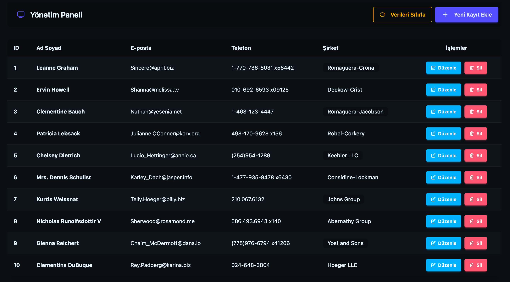

# Software Persona - JavaScript Projesi

TNC Group **Software Persona** eğitimi kapsamında hazırlanan, modern bir Kullanıcı Yönetim Paneli (CRUD) uygulamasıdır. Sahte API (JSONPlaceholder) ile başlatılan veriler, sayfa yenilemelerinde kaybolmaması için LocalStorage üzerinde tutulmaktadır.

## 🛠 Kullanılan Teknolojiler

React (Vite), TypeScript, Tailwind CSS, daisyUI, Axios, React Icons.

## 📥 Hızlı Kurulum

Projeyi bilgisayarınızda çalıştırmak için terminalde sırasıyla şu komutları girin:

## 🔗 Bağlantılar ve Görseller

Canlı Önizleme: [Netlify Preview](https://tnccrud.netlify.app/)


```bash
git clone (https://github.com/enesece/tnc-web-crud.git)
cd proje-dizini
npm install
npm run dev
```
